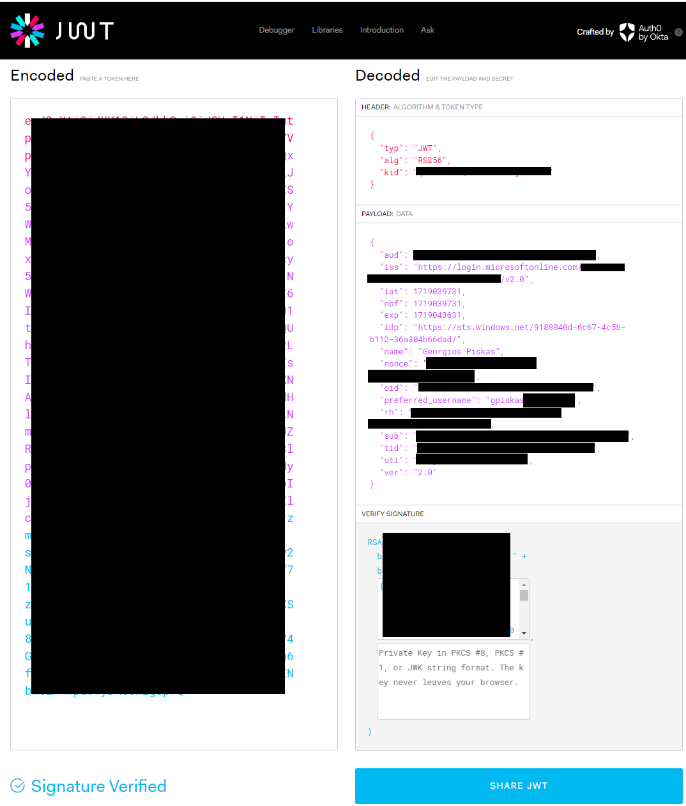
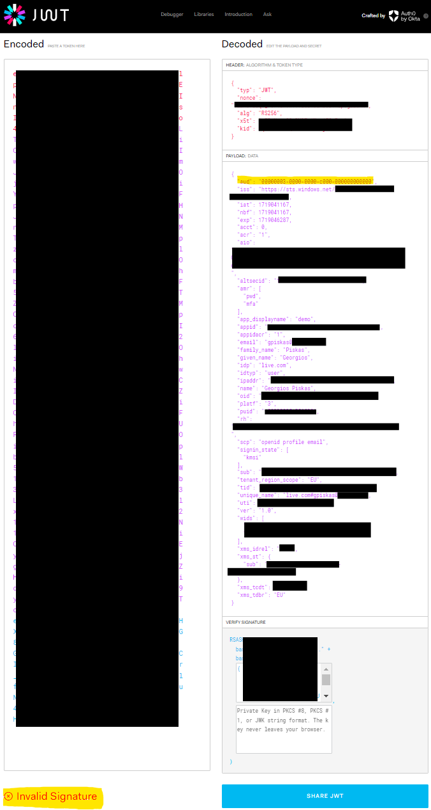
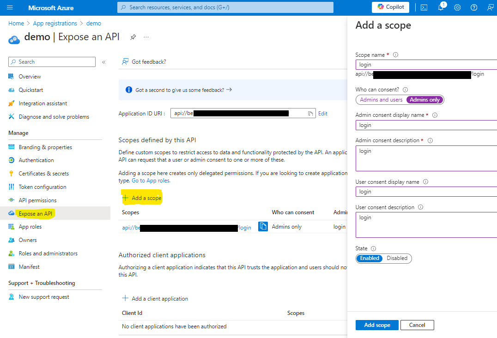
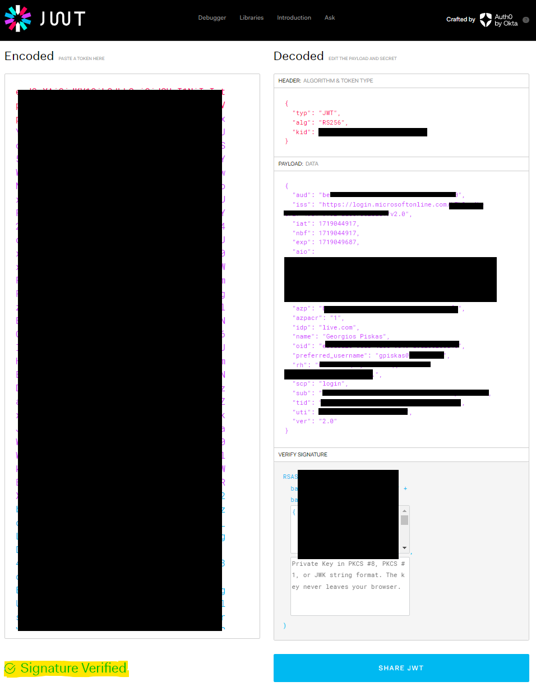

When working with a Spring Boot application using OAuth 2.0 and OIDC (OpenID Connect protocol) you might need at some point to access the tokens of the logged in user. These are stored in the Security Context of Spring Security. In the following example I have set up a demo application using Spring Cloud Azure that simply authenticates a user, and then reads the ID token and Access token. If you want to learn more about refresh tokens [check out this article](https://gpiskas.com/posts/refresh-oauth2-tokens-spring-boot-spring-cloud-azure/). 

## Table of Contents

## Setting Up the Application
For a detailed explanation on how to set up a Spring Boot OAuth 2.0 app [refer to this article](https://gpiskas.com/posts/refresh-oauth2-tokens-spring-boot-spring-cloud-azure/). I explain step by step how to achieve this, and this is a prerequisite for the rest.

## Retrieving the ID Token
After authenticating, the ID Token is stored in the `Principal` object which is found within the `Authentication` object of the `Security Context`. After casting to the right types (`DefaultOidcUser` and `OAuth2AuthenticationToken`), you can finally fetch the `OidcIdToken` object that contains the raw token value as well as the claims parsed in a map. along with other information.

```java
public OidcIdToken getIdToken() {
    Authentication authentication = SecurityContextHolder.getContext().getAuthentication();
    if (authentication instanceof OAuth2AuthenticationToken token && token.getPrincipal() instanceof DefaultOidcUser user) {
        OidcIdToken idToken = user.getIdToken();
        log.info("Token raw value: {}", idToken.getTokenValue());
        log.info("Token claims map: {}", idToken.getClaims());
        return idToken;

    }
    throw new IllegalStateException("Oauth2 Security Context not found!");
}
```

If you try to [decode the token using jwt.io](https://jwt.io/) you will see something like the following. Tokens contain sensitive information so be careful when sharing them.


## Retrieving the Access Token
In most scenarios you won't need to access or use the ID Token yourself, Spring Security will handle it. However, Access Tokens are necessary to call third party APIs and you will need to manage them (unless a library is doing it for you behind the scenes). In the example below, we are fetching the access token acquired during login with scopes `openid, profile, email`. However, you can't do much with that token as it's considered as invalid, because the `aud` (audience) claim is set to `00000003-0000-0000-c000-000000000000`, corresponding to the Microsoft Graph API. These kind of tokens are issued for MS Graph and are not supposed to be validated or used in any way. To access this token we are using the `OAuth2AuthorizedClientManager`.

```java
@Autowired
private OAuth2AuthorizedClientManager oAuth2AuthorizedClientManager;

public OAuth2AccessToken getAccessToken() {
    Authentication authentication = SecurityContextHolder.getContext().getAuthentication();
    if (authentication instanceof OAuth2AuthenticationToken token) {
        OAuth2AuthorizeRequest authRequest = OAuth2AuthorizeRequest
                .withClientRegistrationId(token.getAuthorizedClientRegistrationId())
                .principal(token)
                .build();
        OAuth2AuthorizedClient client = oAuth2AuthorizedClientManager.authorize(authRequest);
        OAuth2AccessToken accessToken = client.getAccessToken();
        log.info("Token raw value: {}", accessToken.getTokenValue());
        log.info("Token scopes: {}", accessToken.getScopes());
        return accessToken;
    }
    throw new IllegalStateException("Oauth2 Security Context not found!");
}
```

[Decoding the token using jwt.io](https://jwt.io/) we get the following information. Interestingly we get an **Invalid Signature** warning in the bottom left, because the `aud` (audience) claim is set to `00000003-0000-0000-c000-000000000000` and does not match the `client id` of the application.



<p class="tip">This is expected and we are not supposed to "fix" this. Instead, we need to request new access tokens on-demand, depending on what apps and scopes we need to access.<p>

For the sake of demonstration, let's try to get a valid access token during login. We need to create a scope for our own App Registration and then request this instead when logging in.

`Step 1`: Add a new scope called `login`.


`Step 2`: Set up the the new Scope in your application properties to be used during login. We are adding an item under `authorization-clients` called `azure`, and setting the `authorization-grant-type` to `authorization_code` in order to override the default login process and use our own `login` scope.
```yaml
spring:
  cloud:
    azure:
      profile:
        tenant-id: your-tenant-id-goes-here
      credential:
        client-id: your-client-id-goes-here
        client-secret: your-client-secret-goes-here
      active-directory:
        enabled: true
        application-type: web-application-and-resource-server # or web-application
        authorization-clients:
          azure:
            authorization-grant-type: authorization_code
            scopes: api://your-client-id-goes-here/login
```

`Step 3`: Inspect the contents of the new Access Token. Now the `aud` claim corresponds to the client id of the App Registration and the signature is verified successfully.


## Using Access Tokens

When you need to call a protected endpoint, you will need to request an access token with the respective scope that provides access to it and then add the token as a header to your API call as in the example below.

```java
headers.set("Authorization", "Bearer " +  accessToken.getTokenValue());
```

 For an explanation on how to acquire access tokens, check out the following articles:
* [Acquiring a Token for Client Credentials Flow (MSAL4J)](https://gpiskas.com/posts/acquiring-token-on-behalf-of-flow-msal4j/)
* [Acquiring a Token for On Behalf Of Flow (MSAL4J)](https://gpiskas.com/posts/acquiring-token-client-credentials-flow-msal4j/)