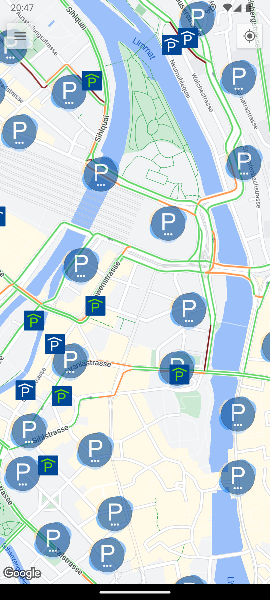
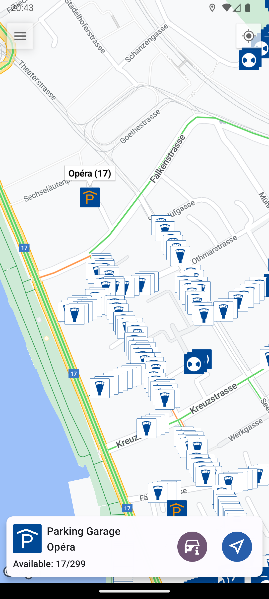

import Copyright from "@components/Copyright.astro";
import LinkButton from "@components/LinkButton.astro";

Easily find public parking spots and parking garages in Zurich.
<LinkButton href="https://play.google.com/store/apps/details?id=com.gpiskas.parkingzurich">Get it on Google Play</LinkButton>.

## Features
- Launch your favorite navigation app towards the selected parking spot.
- Real time occupancy information for parking garages, color coding of markers and deep links to useful pages.
- Choose from multiple parking types to display on the map or combine multiple types at the same time (e.g. white, blue and garages).
- Dense parking areas are clustered together, while garages are always displayed.
- Map customization and filters. 
- App also in German.
- <LinkButton href="/about">Your support is greatly appreciated</LinkButton>

